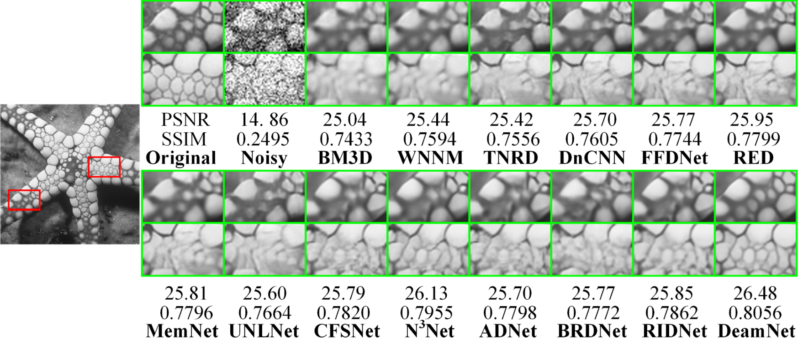
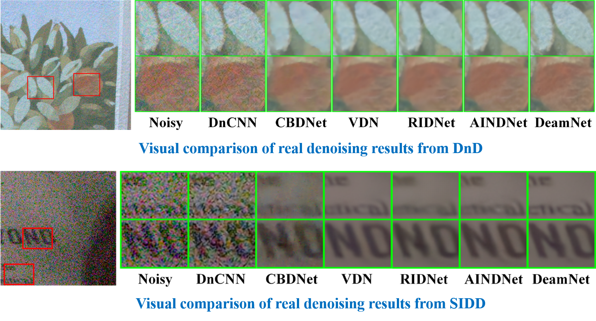

## Adaptive Consistency Prior based Deep Network for Image Denoising (CVPR 2021)

### Introduction

This is the research code for the paper:

Chao Ren, Xiaohai He, Chuncheng Wang, and Zhibo Zhao, "Adaptive Consistency Prior based Deep Network for Image Denoising", CVPR 2021, oral. [PDF](https://openaccess.thecvf.com/content/CVPR2021/papers/Ren_Adaptive_Consistency_Prior_Based_Deep_Network_for_Image_Denoising_CVPR_2021_paper.pdf), [Supp](https://openaccess.thecvf.com/content/CVPR2021/supplemental/Ren_Adaptive_Consistency_Prior_CVPR_2021_supplemental.pdf)

The proposed method achieves the state-of-the-art performance on image denoising.

### Citation

If you find the code and dataset useful in your research, please consider citing:

	@InProceedings{Ren_2021_CVPR,
	    author    = {Ren, Chao and He, Xiaohai and Wang, Chuncheng and Zhao, Zhibo},
	    title     = {Adaptive Consistency Prior Based Deep Network for Image Denoising},
	    booktitle = {Proceedings of the IEEE/CVF Conference on Computer Vision and Pattern Recognition (CVPR)},
	    month     = {June},
	    year      = {2021},
	    pages     = {8596-8606}
	}
### Introduction

In this paper, we propose a novel deep network for image denoising. Different from most of the existing deep network-based denoising methods, we incorporate the novel ACP term into the optimization problem, and then the optimization process is exploited to inform the deep network design by using the unfolding strategy. Our ACP-driven denoising network combines some valuable achievements of classic denoising methods and enhances its interpretability to some extent. Experimental results show the leading denoising performance of the proposed network.

We train our DeamNet for AWGN and real-world noise, and some visual results are simply shown as follows:

Visual quality comparison for ‘Starfish’ from Set12 with noise level 50

### Contents
|  Folder    | description |
| ---|---|
|checkpoint | To save models when training|
|Dataset| Contains three folders(train, test and Benchmark_test), you can place train dataset in train, test dataset in test, and SIDD/Dnd benchmark in Benchmark_test
|Deam_models|The pretrained models when you want to test|
|real|Some python files about real image denoising|
|statistics|To record the results when training|

### Training on AWGN 
To retrain our network, please place your own training datasets in `./Dataset/train` and simply run the `train.py`

### Training on real-world noise
To retrain our network for real-world noise removal:

Download the training dataset to `./Dataset/train` and use `./Dataset/train/gen_dataset_real.py` to package them in the h5py format.

You can get the datasets from: https://www.eecs.yorku.ca/~kamel/sidd/dataset.php and http://ani.stat.fsu.edu/~abarbu/Renoir.html

Set the training and testing path to your own path and run `train.py`. For more details, please refer to https://github.com/JimmyChame/SADNet

### Testing on AWGN
To test your own images, place your dataset in `Dataset/test/your_test_name` and run `Synthetic_test.py`
### Testing on real-world noise
To test on real-world noisy datasets:

Download the testing dataset to `./Dataset/Benchmark_test` and run `Benchmark_test.py`

You can get the datasets from https://www.eecs.yorku.ca/~kamel/sidd/benchmark.php and https://noise.visinf.tu-darmstadt.de/benchmark/

Feedbacks and comments are welcome!
Enjoy!
